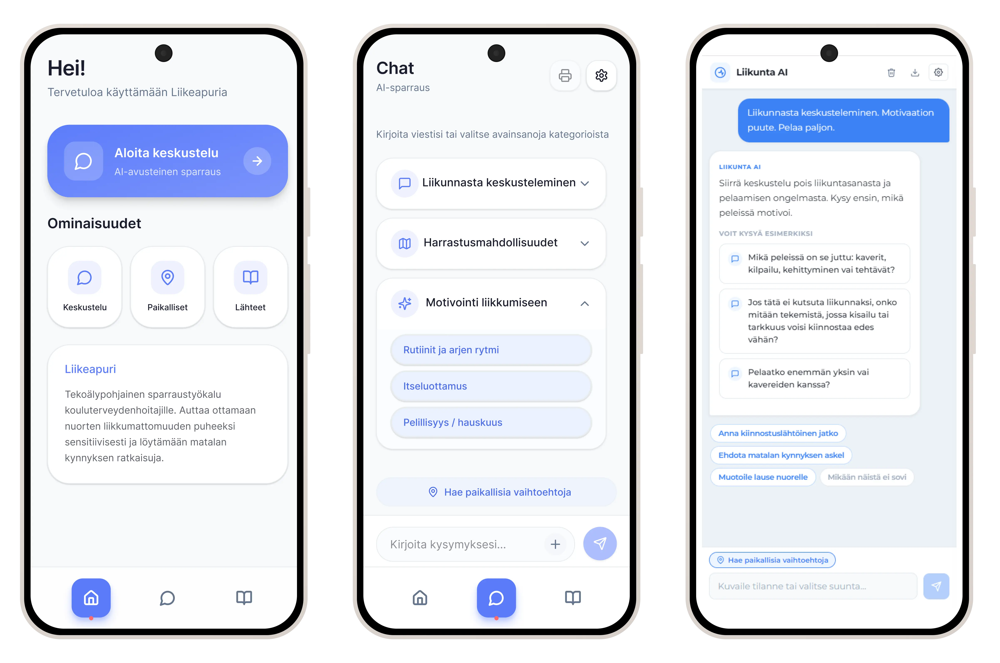
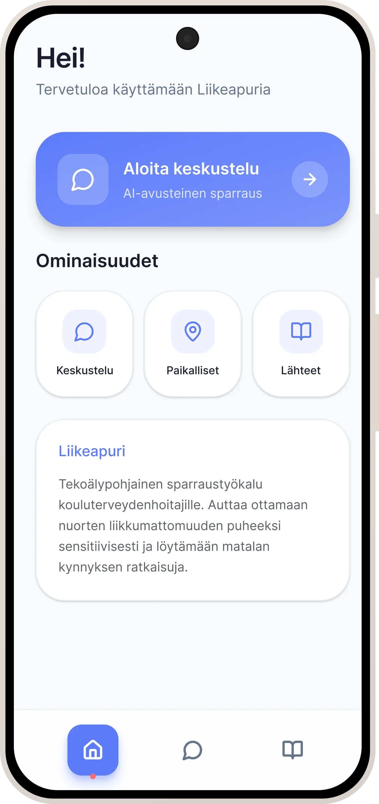

# Liikeapuri

## 1. Hero ja koukuttava otsikko

**Sensitiivisen liikuntakeskustelun tukeminen AI-avusteisella sparraustyökalulla kouluterveydenhoitajille**

Liikeapuri on terveydenhuollon ammattilaisille suunnattu AI-avusteinen sparraustyökalu. Se tukee liikunnan puheeksiottoa tilanteissa, joissa nuoren liikkumattomuuden taustalla voi olla esimerkiksi motivaation puutetta, kehohäpeää, mielenterveyden haasteita, aiempia huonoja kokemuksia tai paikallisen tiedon hajanaisuutta.

---

## 2. Kolme vahvinta näyttöä

1. **Jäljitettävä tuotemäärittely AI-ratkaisulle**  
Laadin tuotevaatimusdokumentin ja prototyypin designmäärittelyn, joissa tuotteen tavoitteet, rajaukset, riskit, saavutettavuusvaatimukset ja ominaisuuksien perustelut kirjattiin näkyviksi. Jokaisen prototyypin ominaisuuden piti vastata kysymyksiin: mitä se tekee, miksi se on olemassa, miten se auttaa käyttäjää ja mitä vaatimuksia sen pitää täyttää. Määrittelyyn kirjattiin myös WCAG AA -tason tavoite, kontrastien ja fonttikokojen huomiointi sekä selkeä, vastaanottotilanteeseen sopiva käyttöliittymä. Tämä loi jatkokehitykselle selkeämmän lähtökohdan kuin pelkkä Figma-prototyyppi.

2. **Toimiva AI-prototyyppi, joka teki riskit näkyviksi**  
   Rakensin React + Vite + Mistral API -pinolla julkaistun AI-prototyypin ([liikunta-ai.vercel.app](https://liikunta-ai.vercel.app)). React-sovelluksen tarkoitus ei ollut viimeistellä UI/UX-ratkaisua, vaan testata AI-logiikkaa, keskustelupolkuja ja vastausten riskejä. Claude Code tuki koodin tuottamista, mutta vastasin toteutuksen ohjauksesta, integraation toimivuudesta ja virheiden korjaamisesta. Testauksessa havaitut väärät oletukset, kysymysloopit ja paikallishaun riskit vietiin suoraan PRD:n vaatimuksiin.

3. **Kevyt agenttilogiikka ja rajattu tietopohja AI-riskien hallintaan**  
   Rakensin prototyyppiin logiikan, jossa sovellus tunnistaa käyttäjän tilanteen ennen mallikutsua ja antaa kielimallille eri ohjeistuksen eri käyttötapauksissa. Paikallishaussa tulokset haettiin rajatusta, kuratoidusta testidatasta eikä vapaasta generoinnista. Tämä teki ratkaisusta ennustettavamman ja jätti jatkokehitykseen selkeästi dokumentoidut suojakerrokset.

---

## 3. Hissipuhe

Liikeapuri on AI-avusteinen sparraustyökalu kouluterveydenhoitajille ja muille nuorten kanssa työskenteleville ammattilaisille. Se auttaa ottamaan liikunnan puheeksi sensitiivisesti, ehdottaa tilanteeseen sopivia jatkokysymyksiä ja tarjoaa erillisen paikallishaun konkreettisten harrastusvaihtoehtojen löytämiseen.

Työkalu ei tee päätöksiä ammattilaisen puolesta. AI toimii taustasparraajana, ja ammattilainen arvioi aina, miten ehdotuksia käytetään vastaanottotilanteessa.

**Casen ydinkysymys:**  
Miten ei-liikunta-alan ammattilainen saa nopeasti sensitiivistä keskustelutukea ja konkreettisia jatkoaskelia tilanteessa, jossa nuoren liikunta on vaikea ottaa puheeksi ja paikallinen tieto on hajallaan?

---

## 4. Projektin perustiedot

| Kategoria | Tiedot |
| --- | --- |
| Toimeksiantaja | Päijät-Hämeen Liikunta ja Urheilu ry (PHLU), oikea asiakastoimeksianto |
| Tuote | AI-avusteinen liikuntaneuvonnan sparraustyökalu terveydenhuollon ammattilaisille |
| Tavoite | Prototypoida työkalu sensitiiviseen puheeksiottoon ja paikallisten vaihtoehtojen tarjoamiseen |
| Oma rooli | Product/Concept, AI-määrittely, PRD, tekninen AI-prototyyppi |
| Tiimi | Hellu Isomäki (PM), Jan Nässi, Fanny Marjakangas, Milla Kamppi, Inka Lindström |
| Kesto | 27.3.–15.5.2026, noin 7 viikkoa |
| Työkalut | Figma, FigJam, Teams, GitHub, VS Code, React + Vite, Mistral API, Webropol, ChatGPT, Claude Code |
| Menetelmät | Haastattelut, Webropol-kysely, Double Diamond, heuristinen arviointi, prototypointi |
| Lopputulos | Figma hi-fi -prototyyppi, toimiva AI-prototyyppi, PRD, UX-raportti |

---

## 5. Konteksti ja ongelma

Kouluterveydenhoitajat kohtaavat vähän liikkuvia nuoria säännöllisesti, mutta heillä ei ole yhtenäistä työkalua liikunnan puheeksioton tueksi. Vastaanottoaika on rajallinen, paikallinen tieto harrastusmahdollisuuksista on hajallaan ja nuoren tilanteen taustalla voi olla monisyisiä psyykkisiä, sosiaalisia tai kokemuksellisia esteitä.

Ongelma ei ollut vain se, että ammattilainen tarvitsisi listan harrastuksista. Haastattelujen perusteella kriittisempi kohta oli usein keskustelun käynnistäminen ja jatkaminen sensitiivisesti. Nuori ei välttämättä ole valmis harrastukseen, vaan tarvitsee ensin pienen, turvallisen ja realistisen etenemisaskeleen.

Projektin tavoitteena oli tuottaa toimeksiantajalle konkreettinen demo, jolla ideaa voidaan esitellä sidosryhmille ja viedä kohti jatkokehitystä. Tätä tukivat käyttäjätarpeeseen perustuvat löydökset, toimiva prototyyppi ja dokumentoitu tuotemäärittely.

**Problem statement:**  
Kouluterveydenhoitaja tarvitsee nopeasti sensitiivistä keskustelutukea ja paikallisia vaihtoehtoja, koska tieto on hajallaan ja nuoren tilanne voi olla monisyinen. Tämä vaikeuttaa liikunnan puheeksiottoa ja jatko-ohjausta vastaanoton aikana.

---

## 6. Oma roolini

Vastasin erityisesti konseptin ja AI-roolin määrittelystä, PRD-dokumentoinnista ja toimivan AI-prototyypin rakentamisesta. Projekti tehtiin moniosaajatiimissä, jossa oma roolini painottui product/concept-, AI- ja vaatimusmäärittelytyöhön.

### Vastasin erityisesti

* tuotteen tavoitteiden, rajausten ja riskien jäsentämisestä PRD:hen
* AI:n roolin määrittelystä taustasparraajaksi, ei päätöksentekijäksi
* toimivan AI-prototyypin rakentamisesta React + Vite + Mistral API -pinolla
* paikallishaun ja keskustelutuen erottamisesta erillisiksi toiminnoiksi
* prototyypin designmäärittelystä, jossa ominaisuudet perusteltiin ennen rakentamista

### Konkreettinen panokseni

Osallistuin toimeksiantajan aloitushaastatteluihin ja ideointityöpajan fasilitointiin. Rakensin projektin aikana dokumentointipohjaa, jota hyödynsin PRD:n kirjoittamisessa. PRD:ssä erotin pilotin, jatkokehityksen ja tuotantotason, jotta konsepti ei paisuisi epärealistiseksi.

AI-prototyypissä käsikirjoitin testiskenaarioita ja kehitin vastauslogiikkaa rinnakkain. Jokainen testissä havaittu virhe muutettiin joko uudeksi prompttisäännöksi, koodisuojaukseksi, hakulogiikan rajaukseksi tai PRD-vaatimukseksi.

Esimerkkejä havainnoista:

* AI teki liian pitkälle meneviä oletuksia pikavalinnan perusteella → vaatimus, ettei pikavalinta yksin aktivoi taustaoletuksia
* AI jäi kysymyslooppiin, vaikka käyttäjä pyysi konkreettista vastausta → sääntö siirtyä seuraavaan käyttökelpoiseen askeleeseen
* Paikallishaku oli riskialtis vapaasti generoituna tekstinä → vaatimus erillisestä paikallishausta ja korttinäkymästä

### Rajaus

En vastannut Figma-UI:n visuaalisesta suunnittelusta tai UX-raportin kirjoittamisesta. Figma hi-fi -prototyypistä vastasi tiimin UI/prototypointirooli, ja UX-raportista vastasivat tiimin UX/research-roolit.

---

## 7. Tutkimus ja tärkeimmät löydökset

Projektissa hyödynnettiin puolistrukturoituja asiantuntijahaastatteluja, Webropol-kyselyä terveydenhoitajille, heuristista arviointia sekä haastatteluaineistoon perustuvaa synteettistä persoonaa. Tutkimuksen tarkoitus ei ollut vain todentaa ideaa, vaan selvittää, missä kohtaa ammattilaisen arkea työkalu voisi oikeasti auttaa.

**Aineisto:**

* asiantuntijahaastattelut, 5 kpl
* Webropol-kysely terveydenhoitajille, n=24
* heuristinen arviointi
* synteettinen persoona käyttäjäaineiston pohjalta

### Keskeiset löydökset

1. **Liikkumattomuuden ydineste ei ole vain tiedon puute, vaan toiminnan käynnistäminen.**  
   Haastattelujen perusteella moni nuori ei ole heti valmis harrastukseen. Siksi ratkaisun painopiste ei voinut olla pelkkä harrastuslista.  
   **Vaikutus ratkaisuun:** keskustelutuki ja matalan kynnyksen etenemisehdotukset nostettiin keskeisiksi toiminnoiksi.

2. **Arkojen aiheiden käsittely vaatii sensitiivistä tukea.**  
   Kehohäpeä, mielenterveys, aiemmat huonot kokemukset ja kiusaaminen voivat tehdä liikunnasta herkän aiheen.  
   **Vaikutus ratkaisuun:** AI rajattiin ammattilaisen sparraajaksi, ja vastauksille määriteltiin sävyyn, oletusten välttämiseen ja jatko-ohjaukseen liittyviä sääntöjä.

3. **Paikallinen harrastustieto on hajallaan ja vaikeasti käytettävää vastaanoton aikana.**  
   Kyselyn perusteella 81 % vastaajista kaipasi tietoa ilmaisista tai edullisista vaihtoehdoista ja 71 % konkreettisia motivointivinkkejä.  
   **Vaikutus ratkaisuun:** paikallishaku erotettiin omaksi toiminnokseen, jossa tulokset esitetään rajattuina kortteina eikä vapaana chat-vastauksena.

---

## 8. Ratkaisuvaihtoehdot ja priorisointi

Alkuvaiheessa ratkaisu ei ollut yksittäinen käyttöliittymänäkymä, vaan useita mahdollisia suuntia. Vertailimme vaihtoehtoja sen perusteella, mikä ratkaisisi sekä puheeksioton ongelman että konkreettisten jatkoaskelten tarpeen.

| Vaihtoehto | Mitä se ratkaisi | Hyöty | Heikkous tai riski | Päätös |
| --- | --- | --- | --- | --- |
| A: Harrastuslista | Paikallisten vaihtoehtojen löytämisen | Helppo ymmärtää ja rajata | Ei tue sensitiivistä puheeksiottoa | Ei yksin riittävä |
| B: AI-keskustelutuki | Puheeksioton ja jatkokysymysten tuen | Vastaa arkaan kohtaamistilanteeseen | Jättää konkreettiset vaihtoehdot ammattilaisen varaan | Tarvitaan osaksi ratkaisua |
| C: Keskustelutuki + erillinen paikallishaku | Puheeksioton ja konkreettisen etenemisen | Yhdistää kohtaamisen tuen ja käytännön vaihtoehdot | Vaatii selkeän rajan AI:n ja haun välille | Valittu ratkaisu |

Valittu ratkaisu oli yhdistelmä: AI-avusteinen keskustelutuki ja erillinen paikallishaku. Tämä oli paras kompromissi, koska se vastasi sekä ammattilaisen keskustelutilanteeseen että tarpeeseen löytää konkreettisia vaihtoehtoja ilman, että paikallistieto jätettiin kielimallin keksittäväksi.

Keskeinen kompromissi oli se, että paikallishaku toteutettiin pilotissa rajatulla testidatalla. Tämä ei ratkaise tuotantotason tiedon ylläpitoa, mutta se teki hakutulosten rakenteen, suodattimet ja riskit testattaviksi projektin aikataulussa.

---

## 9. Lopullinen ratkaisu

Lopullinen ratkaisu oli AI-avusteinen sparraustyökalu, joka tukee ammattilaista sensitiivisessä liikuntakeskustelussa ja tarjoaa paikallisen harrastushaun omana, rajattuna toimintona.

Ratkaisun ydin oli kolmeosainen:

1. **Sensitiivinen keskustelutuki**  
   AI ehdottaa avausfraaseja, jatkokysymyksiä ja pieniä etenemisaskeleita. Se ei tee diagnoosia eikä päätä ammattilaisen puolesta. Toimintamalli hyödyntää mini-interventioajattelua: ammattilainen saa lyhyitä, tilanteeseen sopivia avauksia ja pieniä seuraavia askelia, ei valmista ratkaisua nuoren puolesta.

2. **Erillinen paikallishaku**  
   Paikalliset vaihtoehdot haetaan rajatusta testidatasta ja näytetään kortteina. Malli ei saa keksiä olemattomia paikkoja.

3. **Lähteiden ja rajojen näkyvyys**  
   Käyttäjälle tehdään näkyväksi, milloin tieto perustuu lähteisiin, rajattuun tietopohjaan tai paikalliseen hakudataan.

**Figma-prototyyppi:** [Avaa Figma-prototyyppi](https://bamboo-lair-48852346.figma.site)

**Toimiva AI-prototyyppi:** [liikunta-ai.vercel.app](https://liikunta-ai.vercel.app)  
React-prototyyppiä voi kokeilla omalla API-avaimella. Prototyyppi tukee Mistral- ja GPT-yhteensopivia API-avaimia, ja avain lisätään sovelluksen asetuksista. Demo on tarkoitettu AI-logiikan, keskustelupolkujen ja vastausten riskien havainnointiin, ei viimeistellyn UI/UX-ratkaisun esittelyyn.

### Visuaalinen nosto 1: Sensitiivinen keskustelutuki

**Miksi tämä on tärkeä:**  
Tämä on ratkaisun ydinarvo. Ammattilainen ei tarvitse vain tietoa liikunnan hyödyistä, vaan tukea siihen, miten aihe otetaan esiin ilman syyllistämistä tai liian nopeita oletuksia.

### Visuaalinen nosto 2: Paikallishaku

**Miksi tämä on tärkeä:**  
Paikallistieto on yksi ammattilaisen arjen kitkakohdista. Erillinen hakutoiminto vähentää riskiä, että AI tuottaa epäluotettavia tai olemattomia paikallisia ehdotuksia.

### Visuaalinen nosto 3: Lähteet ja luotettavuus

**Miksi tämä on tärkeä:**  
Terveydenhuollon kontekstissa ammattilaisen pitää pystyä arvioimaan, mihin ehdotus perustuu. Siksi tiedon lähteet ja rajat ovat osa tuotteen luottamusta.

### Tekninen ratkaisu: ohjattu AI eikä vapaa generointi

Terveydenhuollon kaltaisessa sensitiivisessä kontekstissa AI:n ei voi antaa vastata täysin vapaasti. Rakensin prototyyppiin kevyen agenttilogiikan: sovellus tulkitsee ensin käyttäjän tilanteen, valitsee oikean vastausmoodin ja antaa kielimallille vain kyseiseen tilanteeseen sopivan ohjeistuksen.

Ratkaisu ei ollut tuotantotason RAG-järjestelmä, mutta se käytti samaa periaatetta: kriittistä tietoa ei jätetä mallin keksittäväksi. Paikalliset vaihtoehdot haettiin rajatusta, kuratoidusta testidatasta, eikä kielimalli saanut generoida omia paikkoja.

Logiikka toimi näin:

1. Käyttäjä kirjoitti viestin tai valitsi pikavalinnan.
2. Sovellus tunnisti, oliko kyse motivointikeskustelusta, harrastuskartoituksesta vai paikallishakupyynnöstä.
3. Sovellus kokosi kielimallille tilanteeseen sopivan ohjeistuksen.
4. Koodissa tehtiin ennen mallikutsua lisätarkistuksia, jotta malli ei tehnyt käyttäjän viestistä irrallisia tai liian arkaluonteisia oletuksia.
5. Paikallishaussa kielimallia ei kutsuttu lainkaan, vaan tulokset haettiin rajatusta testidatasta.

Tämän teknisen ratkaisun arvo ei ollut pelkästään toimiva demo. Se teki AI:n riskit näkyviksi ja tuotti PRD:hen konkreettisia jatkokehityksen lähtökohtia: moodikohtaiset säännöt, paikallishaun rajaus, datarakenteet ja suojakerrokset sensitiivisiä tilanteita varten.

### Teknologiavalinta ja eettiset periaatteet

Valitsimme prototyypin kielimalliksi Mistralin, koska sensitiivisessä terveydenhuollon kontekstissa teknologian valinnassa korostuivat eurooppalainen toimintaympäristö, GDPR-yhteensopivuus, kustannustehokas API-käyttö ja mahdollisuus testata AI-logiikkaa kevyesti ennen raskaampaa tuotantoratkaisua.

Eettisyys kirjattiin osaksi tuotemäärittelyä. PRD:ssä AI rajattiin ammattilaisen taustasparraajaksi, ei päätöksentekijäksi, lääkäriksi tai terapeutiksi. Suunnittelussa hyödynnettiin Sitran reilun datatalouden periaatteita sekä toimeksiantajan vastuullisuustavoitteita: yhdenvertaisuutta, moninaisuuden huomioimista, turvallista toimintaympäristöä, hyvää hallintoa ja ympäristövastuullisuutta.

Käytännössä tämä näkyi siinä, että paikallishaku erotettiin vapaasta AI-generoinnista, lähteiden näkyvyys kirjattiin vaatimuksiin, ammattilaiselle jätettiin lopullinen arviointivastuu ja jatkokehitykseen kirjattiin teknologian riittävyyden periaate: käytetään pienintä riittävää mallia ja vältetään tarpeettomia API-kutsuja.

---

## 10. Keskeiset design-päätökset

| Päätös | Vaihtoehdot | Lopullinen päätös | Perustelu |
| --- | --- | --- | --- |
| AI:n rooli | Asiantuntija, päätöksentekijä tai sparraaja | Sparraaja | Ammattilainen tekee päätökset. Terveydenhuollon konteksti vaatii vastuun säilyttämistä ihmisellä. |
| Paikallishaku | Vapaa chat-generointi tai rajattu hakulogiikka | Erillinen paikallishaku rajatulla datalla | Vähentää virheellisten tai olemattomien paikallisten ehdotusten riskiä. |
| Prototypoinnin painopiste | WoZ-testaus tai toimiva AI-prototyyppi | Toimiva AI-prototyyppi | WoZ-testaus rajautui pois, koska oikeita testikäyttäjiä ei saatu riittävästi mukaan projektin aikataulussa. Toimiva AI-proto teki silti mallin käyttäytymisen, riskit ja jatkokehitystarpeet näkyviksi. |
| Vastausten ohjaus | Yksi yleinen prompti tai tilanteen mukaan vaihtuvat säännöt | Moodikohtainen ohjaus ja koodisuojaukset | Eri tilanteet vaativat eri vastauslogiikan. Sensitiivinen keskustelu ja paikallishaku eivät voi toimia samalla säännöstöllä. |

---

## 11. Validointi, vaikutus ja rajoitteet

### Mitä saatiin aikaan?

Projektin lopputuloksena syntyi Figma hi-fi -prototyyppi, toimiva AI-prototyyppi, tuotevaatimusdokumentti ja UX-raportti. AI-prototyyppi teki näkyväksi, miten kielimalli käyttäytyy sensitiivisissä skenaarioissa ja missä kohdissa sovelluslogiikan pitää rajoittaa tai ohjata vastausta.

### Mitattu vaikutus

Projektissa ei ollut käytettävissä julkaisun jälkeistä analytiikkaa eikä riittävää käyttäjätestausta mitatun vaikutuksen todentamiseen. Siksi vaikutusta ei esitetä mitattuna parannuksena.

### Laadullinen ja odotettu vaikutus

Ratkaisun odotettu vaikutus käyttäjälle on selkeämpi runko sensitiiviseen liikuntakeskusteluun ja konkreettisemmat jatkoaskeleet vastaanoton tueksi. Ammattilainen saa nopeasti vaihtoehtoisia avauksia, jatkokysymyksiä ja paikallisia vaihtoehtoja ilman, että hänen täytyy keskeyttää vastaanotto hajanaisen tiedonhaun vuoksi.

Ratkaisun odotettu vaikutus toimeksiantajalle on konkreettinen demoratkaisu ja dokumentoitu jatkokehityspohja. Prototyyppi, PRD ja tutkimuslöydökset tarjoavat aineiston, jonka perusteella ratkaisua voidaan arvioida, testata ja kehittää eteenpäin.

| Todiste tai signaali | Mitä se osoittaa? | Miksi sillä on merkitystä? |
| --- | --- | --- |
| Webropol-kysely, n=24 | Ammattilaisilla on tarve edullisille vaihtoehdoille ja konkreettisille motivointivinkeille | Tukee ratkaisun kahden päätoiminnon valintaa: keskustelutuki ja paikallishaku |
| Asiantuntijahaastattelut | Liikkumattomuuden taustalla on usein psyykkisiä ja sosiaalisia esteitä | Tukee sensitiivisen sparrauksen tarvetta |
| AI-prototyypin testaus | Malli teki oletuksia, jäi kysymyslooppeihin ja vaati tarkempaa ohjausta | Muutti prototyypin havainnot konkreettisiksi PRD-vaatimuksiksi |
| Välipalaute | Konseptin suunta koettiin oikeansuuntaiseksi | Tukee jatkokehityksen perustelua, mutta ei vielä todista vaikuttavuutta |

### Rajoitteet ja sokeat pisteet

| Oletus tai rajaus | Miksi se on riski? | Miten validoisin sen? |
| --- | --- | --- |
| Ammattilainen ehtii käyttää työkalua vastaanoton aikana | Vastaanottotilanne voi olla liian kiireinen | Testaus realistisessa vastaanottoskenaariossa |
| AI-vastaukset ovat riittävän turvallisia ja käyttökelpoisia | Sensitiivinen aihe ei kestä huonoja tai vähätteleviä vastauksia | Skenaariotestaus oikeilla terveydenhoitajilla ja asiantuntija-arvio |
| Paikallisen tiedon ylläpito on ratkaistavissa | Tieto vanhenee nopeasti ja vastuut voivat jäädä epäselviksi | Ylläpitomallin ja datavastuun määrittely jatkokehityksessä |
| Rajattu testidata riittää demonstroimaan paikallishaun arvon | Pilotin data ei vielä todista tuotantotason haun toimivuutta | Testi ylläpidetyllä tai kumppanien tarjoamalla ajantasaisella datalla |

### Seuraava järkevä testi

Pienin järkevä seuraava testi olisi 5–10 kouluterveydenhoitajan testaus realistisissa vastaanoton kaltaisissa tilanteissa. Testissä mitattaisiin erityisesti:

* itsearvioitu varmuus ennen ja jälkeen työkalun käytön
* tehtävän onnistuminen: löytääkö ammattilainen käyttökelpoisen avauksen tai jatkoaskeleen
* vastausten sävyn sensitiivisyys
* paikallishaun relevanssi ja ymmärrettävyys
* käytön nopeus vastaanottotilanteessa

---

## 12. Reflektio ja krediitit

### Mikä onnistui?

Onnistuin siinä, että autoin jäsentämään laajan ongelmakentän tiimille selkeäksi ja testattavaksi konseptiksi. Toimeksianto antoi suunnan, mutta projektin aikana piti tarkentaa, mikä osa ongelmasta ratkaistaan pilotissa ja miten se muutetaan konkreettisiksi ominaisuuksiksi. Lopputuloksena konsepti rajautui ammattilaisen sensitiivisen keskustelutuen ja paikallisen ohjauksen yhdistelmäksi.

Toinen onnistuminen oli se, että AI-prototyyppiä ei käsitelty vain teknisenä kokeiluna. Käytin sitä määrittelyn työkaluna: huono AI-vastaus ei ollut vain virhe, vaan signaali siitä, mitä pitää rajata, ohjata tai dokumentoida seuraavaa kehitysvaihetta varten.

### Mikä jäi epävarmaksi?

Suurin epävarmuus liittyy todelliseen käyttötilanteeseen. Emme ehtineet validoida työkalua riittävällä määrällä oikeita terveydenhoitajia vastaanoton kaltaisessa tilanteessa. Siksi vaikutus on tässä vaiheessa odotettu ja laadullisesti perusteltu, ei mitattu.

Toinen avoin kysymys on paikallisen tiedon ylläpito. Pilotissa rajattu testidata riitti hakulogiikan demonstrointiin, mutta tuotantotasolla pitäisi ratkaista, kuka ylläpitää tietoa, miten se tarkistetaan ja miten käyttäjälle näytetään tiedon ajantasaisuus.

### Mitä opin?

* AI-kokemus ei synny yhdestä hyvästä promptista, vaan käyttöliittymän, datan, sovelluslogiikan, promptien ja turvallisuusrajausten yhdistelmästä.
* Prototyyppi voi olla myös vaatimusmäärittelyn työkalu: se tekee riskit, oletukset ja puuttuvat säännöt näkyviksi ennen tuotantokehitystä.
* Sensitiivisessä kontekstissa tärkein design-päätös voi olla se, mitä AI ei saa tehdä.
* Product/concept-roolissa arvo syntyy usein siitä, että laaja ongelmakenttä muutetaan rajatuksi, perustelluksi ja testattavaksi suunnaksi.

### Mitä tekisin toisin?

Käsittelisin testikäyttäjien rekrytoinnin kriittisenä projektiriskinä jo kickoff-vaiheessa. Wizard of Oz -testaus ja laajempi käyttäjätestaus jäivät vajaiksi, koska oikeita testikäyttäjiä ei saatu riittävästi mukaan projektin aikataulussa. Seuraavassa projektissa rakentaisin validoinnille aiemmin varasuunnitelman, kuten asiantuntija-arvioinnin, kevyen skenaariotestauksen ja synteettisten persoonien käytön ennen hi-fi-vaihetta.

Rajaisin myös teknisen pilotin alussa vielä tiukemmin kahteen asiaan: sensitiivisen keskustelutuen laatuun ja paikallishaun luotettavuuteen. Tämä olisi voinut vähentää ominaisuuksien määrää ja vahvistaa validoinnin fokusta.

### Mitä tekisin seuraavaksi?

Jatkan Liikeapurin kehittämistä Fanny Marjakankaan kanssa opinnäytetyönä toimeksiantajalle. Tavoitteena on arvioida prototyypin käyttökelpoisuutta ammattilaisten työssä ja tuottaa käyttäjätestaukseen perustuvat jatkokehitysehdotukset AI-vastausten, paikallishaun ja käyttöliittymän kehittämiseksi.

Ensisijainen kohderyhmä on terveydenhoitajat. Toissijaisesti tarkastelemme nuoriso-ohjaajia, jotta voimme tunnistaa kohtaamisen ja matalan kynnyksen vuorovaikutuksen käytäntöjä, joita voidaan soveltaa myös terveydenhoitajien työn tueksi. Työssä kehitetään testattavaa prototyyppiä, ei tuotantovalmista järjestelmää.

### Krediitit

Projekti tehtiin yhteistyössä Haaga-Helian Digimestari-tiimin ja toimeksiantajan kanssa.

* Hellu Isomäki: projektinhallinta
* Inka Lindström: Figma hi-fi -prototyyppi ja UI-työ
* Fanny Marjakangas: UX-tutkimus ja UX-raportti
* Milla Kamppi: UX-tutkimus ja UX-raportti
* Jan Nässi: konsepti, AI-määrittely, PRD ja toimiva AI-prototyyppi

---

## 13. Artifacts

| Tuotos | Kuvaus | Linkki |
| --- | --- | --- |
| Figma hi-fi -prototyyppi | Tiimin viimeistelty käyttöliittymäprototyyppi | [Avaa Figma-prototyyppi](https://bamboo-lair-48852346.figma.site) |
| Toimiva AI-prototyyppi | React + Vite + Mistral API -prototyyppi AI-logiikan testaamiseen. Vaatii oman API-avaimen sovelluksen asetuksista. | [liikunta-ai.vercel.app](https://liikunta-ai.vercel.app) |